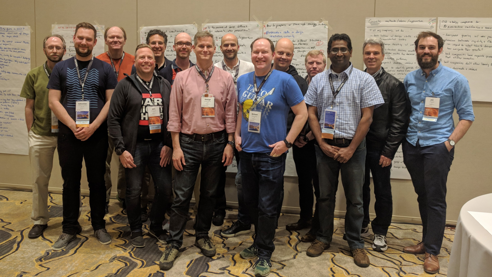

# SATURN 2018: Growing great software designers

The current generation of software designers is coming up in a world where it’s
easier than ever to get started in software development.  Getting information on
how to design doesn’t require apprenticing with a master, traveling to a top
university or tech hub, or piecing together wisps of current research in conference
papers.  The canon is reasonably accessible in books that survey the field, there
is a single-purpose textbook on software aimed at novices, and there are several
conferences on software design that have each been running for more than a decade
(including SATURN).

But, for someone who is trying to nurture the next generation of designers, it seems
as hard as ever to do so.  Some challenges include:

* The large volume of information to master
* The number of contradictory voices claiming to know the true path
* The temptations of easy wins with quick and dirty code
* The siren song of niche expertise (eg ML, distributed systems, programming
  languages) over general software design expertise
* The churn of technical platforms, which often lose the accumulated wisdom of
  the last platform while seeking simplicity
* The rise of results-oriented processes that downplay the value of careful design
* The seeming reduction in the popularity of software books, perhaps in because of
  easy access to blogs and tech news sites offering advice

This workshop is an opportunity to share what we have learned and are applying in
our day jobs about how to grow great software designers.  Expect to hear and share
stories of valiant attempts, grand strategies, energizing wins, and humbling defeats.
We will work to generalize and distill our discussions so that others can benefit from
them.

The goal of this workshop is to explore how to grow great software designers.  Our hope
is that we'll end the day with several concrete suggestions and practices to share with
the SATURN community, some _ah-ha!_ moments, and a collection of challenges that must be
overcome in today’s software shops.

The workshop took place on Monday, May 7, 2018 in [Plano, TX during the
SATURN 2018 conference on software architecture](http://www.sei.cmu.edu/saturn/2018/).

## Workshop Participants

* George Fairbanks - [@GHFairbanks](https://twitter.com/GHFairbanks)
* Michael Keeling - [@michaelkeeling](https://twitter.com/michaelkeeling)
* Randy Ynchausti
* Thijmen de Gooijer
* Michael Turner - [@visteonSW](https://twitter.com/visteonSW)
* Joe Runde
* Adam Wynne
* Matthias Kittner
* Harald Wesenberg - [@hwes](https://twitter.com/hwes)
* Jorn Olmheim - [@joelmheim](https://twitter.com/joelmheim)
* Sebastian von Conrad
* James Ivers
* Eltjo Poort

## Position Papers

[We asked everyone to do some thinking ahead of the workshop in the form of
a brief position paper](position-papers).  The purpose of this position paper was
to get everyone thinking critically about the topic on your own,
but also by reading other ideas before the start of the workshop.

# About SATURN

The 14th SEI Architecture Technology User Network (SATURN) Conference — the longest-running software architecture conference in the world — brings together influential leaders and experts to discuss architecture-centric practices for developing, acquiring, and maintaining software-reliant systems. Architects from more than 20 countries meet annually at SATURN to share ideas, network, and learn about new and existing technologies. For more information, go to [http://www.sei.cmu.edu/saturn/2018](http://www.sei.cmu.edu/saturn/2018).

- [SATURN 2018 Program](https://saturn2018.sched.com/)
- [SATURN 2018 Registration](https://resources.sei.cmu.edu/news-events/events/saturn/registration.cfm)
- [SATURN 2017 Workshop: Functional Architecture](https://github.com/michaelkeeling/saturn2017-architecture-functional-workshop)
- [SATURN 2016 Workshop: Containers](https://github.com/michaelkeeling/saturn2016-containers-workshop)
- [SATURN 2015 Workshop: Microservices](https://github.com/michaelkeeling/SATURN2015-Microservices-Workshop)

## Workshop Organizers

* [George Fairbanks](https://github.com/georgefairbanks) |
  [@GHFairbanks](https://twitter.com/GHFairbanks) |
  [http://georgefairbanks.com](http://georgefairbanks.com/)
* [Michael Keeling](https://github.com/michaelkeeling) |
  [@michaelkeeling](https://twitter.com/michaelkeeling) |
  [http://neverletdown.net](http://neverletdown.net)
