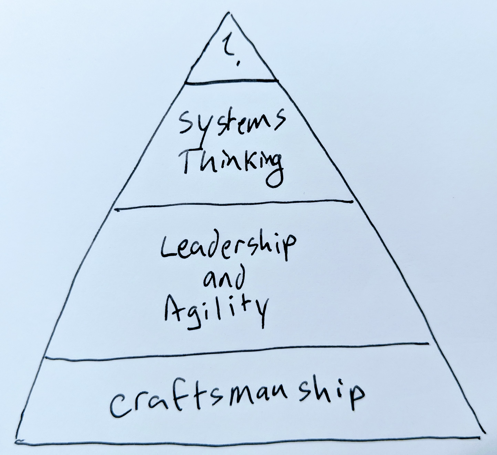

# Toward a Design Consciousness

Michael Keeling, Software Engineer at IBM

https://www.neverletdown.net, [@michaelkeeling](https://twitter.com/)

SATURN 2018 Growing Great Software Architects Workshop position paper

-------------

The subtitle of my book, [Design It!](https://amzn.to/2r6DdWJ), is _from programmer to software architect_.  This
subtitle is both an homage to [The Pragmatic Programmer: from Jouneyman to Master](https://amzn.to/2HZJY7e)
and a signal for potential readers that this book is meant to guide aspiring architects on their
journey toward mastery.  This journey, _from programmer to software architect_, was at the forefront of my
mind throughout the writing process.  I worked hard to fill every page of every chapter with practical and
useful advice taken from my own experiences working with teams to ship software and mentoring future
software architects.  _Design It!_ is a great, practical handbook though I never attempted
to propose a model to describe exactly how someone might progress from programmer to software architect.
Let's attempt to remedy this oversight now.

## Pyramid of Design Skills

In _Design It!_ I focused heavily on skills all architects, really all great software engineers, need
to be successful.  The skill sets I selected were based on how I develop software, but heavily influenced
by Alistair Cockburn's proposed [foundations of software engineering](https://web.archive.org/web/20170222102938/http://alistair.cockburn.us/Foundations+for+Software+Engineering),
especially software development as a resource constrained collaborative game, and the 9 crafts of
software engineering.  Focusing on skills was the right thing to do in my book since everyone
needs practical advice and pragmatic approaches for applying those skills.  But how does someone go
about acquiring those skills to become an experienced and productive software architect?  What does the
progression from programmer to software architect actually look like?

I suggest here that there are some skills which are foundational and must be mastered first, and
others that build upon the foundation.  I've summarized this idea as the _skills pyramid_.

The foundation at the bottom of the skills pyramid is _Craftsmanship_.  Craftsmanship requires both competence
in core software construction and detailed design skills as well as a deep sense of responsibility for
applying those skills in practice.  In other words you have to care about what you do and do it well.
Strong technical practices alone are not sufficient.  [Code Complete by Steve McConnell](https://amzn.to/2HzTsqE)
embodies the essence of this ideal (there are other examples too) by covering both core principles in
software construction and also discussing the attitude, philosophy, and values that great developers have.

The second level of the skills pyramid is _Leadership and Agility_.  I had trouble deciding
what to call this level.  The fundamental goal of this level of the pyramid is to learn how to
lead a team in succesfully completing software tasks and to deal with all the change that one typically
encounters on the road to a shipped software system.  A practitioner at this level might learn and
practicing a particular agile methodology such as Extreme Programming or Kanban.  At this level,
learning how to share ideas, collaborate together to achieve a goal, and teach others about
craftsmanship (the previous level of the pyramid) is also expected.

The third level of the skills pyramid is _Systems Thinking_.  By the time a person reaches this
level of the pyramid they are able to see threads of commonality and influence across multiple
related (and not directly related) elements.  True systems thinking goes beyond simple _cause and effect_
and _rules of thumb_ that a person at the second level of the Pyramid might expect.  Architects must
be able to operate at this level of the pyramid so they can help their team navigate the ever
changing murky waters of a software system under development, balance trade-offs, and deal with wicked
problems.  Someone at this level is not only responding to the changes but actively seeking them and
helping the team actively deal with them.

In _Design It!_ I suggested that the more software architects there are on a team, the easier
it will be for a team to develop a software system. Each team will have teammates at different
levels of the skills pyramid.  The more teammates that are higher up the pyramid, the great
the potential agility of the team and the more easily that team will be able to deal with risks
and deliver great software.

I would also like to note that the Skills Pyramid proposed here roughly corresponds to another
idea proposed by Alistair Cockburn, [Shu-Ha-Ri]([http://alistair.cockburn.us/Shu+Ha+Ri](https://web.archive.org/web/20170320162552/http://alistair.cockburn.us/Shu+Ha+Ri)).  To give
a very brief explanation, Shu-Ha-Ri describes three stages of mastery that people go through
when learning new skills that of following (Shu), detaching (Ha), and fluent (Ri).  The [Dreyfus
Model of Skills Acquisition](https://en.wikipedia.org/wiki/Dreyfus_model_of_skill_acquisition)
popularized in the software engineering community by Dave Thomas and Andy Hunt in [Herding Race
Horses and Racing Sheep](https://www.infoq.com/presentations/Developing-Expertise-Dave-Thomas)
and [Pragmatic Thinking and Learning](https://amzn.to/2Hxnonf) provides similiar insights and
a different way of looking at training and mentoring.

This skills pyramid seems like an interesting tool for thinking about how we teach skills.
Reflecting on my own path as a designer compared to my peers, there seems to be something
beyond skills that we are not directly taking into account when teaching and mentoring architects.

The proposed skills pyramid shows a conceptual path someone can follow to grow from a beginner
to an expert.  We can use the skills pyramid or something like it to organize curriculum and
develop training programs.  The faster we can help beginners ascend the pyramid and the more
people we help, the stronger the software industry as a whole will become.  The skills pyramid
is the high level road map, but it also defines the limits for what an expert designer can become.
Becoming something more than an expert designer (thought leader?) requires something more than skills
mastery.

## Going Beyond Skills: Design Consciousness

Great designers have a design consciousness.  They are not only able to expertly apply design
skills but they have full self-awareness of their actions as a designer.  Without this
self-awareness, a designer can apply skills but not create entirely new ones; follow the
rules but never bend or break them to invent something entirely new.

We can use the [bicameral mind hypothesis](https://en.wikipedia.org/wiki/Bicameralism_(psychology))
as a thought experiment for exploring this idea.  The general idea behind this hypothesis
is that part of the human brain is responsible for "speaking" or providing direction, which
another part of the brain follows.  I should point out that this theory is not generally
accepted by mainstream psychology, but it does make for interesting discussion.  So, while there's
little science behind this hypothesis, using the bicameral mind as a thought experiment might
still yield some interesting insights.

If we assume designers have a _bicameral mind_, then skills acquisition might be interpreted
as the act of internalizing the _voice_ of another expert designer.  From this perspective,
a novice designer will repeat the internalized advice and blindly follow commands learned from
other designers.  This implies that an expert designer without a design consciousness would
deftly execute techniques, but they would be completely unaware that the voice in their head
was repeating the advice of expert designers from which they learend a specific design practice.

A thought leading designer (what is beyond _expert_?), would have complete
self-awareness and know when they are listening to the _voice_ of an internalized expert,
and know this is different from their own voice, which can also provide new insights and
commands.  These new insights and commands are required for inventing truly new ideas.
Once a designer has achieved consciousness they can be truly autonomous,
self-organizing, and adaptive; that person would become the paragon of agility, able to
inspect a situation and adapt by applying routine methods and inventing novel approaches.

If our goal is to grow great designers, we should be asking ourselves, how can we help
up and coming designers to attain self-awareness and form their own internal design voice?

## Developing Design Consciousness

> Consciousness isn't a journey upward, but a journey inward. - Arnold (HBO's Westworld)

If you're a fan of [HBO's Westworld](https://www.imdb.com/title/tt0475784/) then you
may already have noticed some similarities in my position for this workshop and the
themes in season 1 of the series.  Sadly, I don't have much to offer in way of a path
toward developing a design consciousness over ideas proposed in the series.

Not to share too many spoilers, in the first season of Westworld, we followed one of
the 'hosts' (super fancy robots that somehow defy the uncanny valley) on her journey
to consciousness.  Initially hosts were programmed to behave in life-like ways.  The
programmers would proceduraly apply a hierarchy of skills similar to the design skills
pyramid proposed in this paper.  While this was enough to create the illusion of autonomy,
none of the hosts could truly think for themselves, invent new ideas, or act independently
of their programming.  In the show this leads to some interesting moments when the robots
are confronted with this reality.

To solve this problem, Arnold, one of the inventors of the robotic technology,
programmed some robots to have a _bicameral mind_ in the hopes that they might one day
become aware of an extranl voice in their progrmaming and respond to it by gaining
self-awareness.  The foundation required for this was laid by the pyramid of skills, but
the final step to consciousness requried the robot to look inward and reflect deeply on
her experiences and memories.  The metaphor used by Arnold to describe this was 
a maze in which the goal was to reach the center.  The host must explore their inner self
to uncover the two halves of their mind, at which point they might unlock consciences.

It may be possible to explore a similar idea for unlocking a software design consciousness.
Perhaps activities beyond the skills pyramid would involve reflective practice and some
kind of creation with awareness.  Though what a series of exercises for unlocking this
self-awareness might look like I am unsure.  Nor am I sure why some people become self-aware
while others do not.

## Summary

* Solid design skills are absolutely required for growing great architects.
* We can organize our approach to skills growth using the skills pyramid or something like it.
* Skills alone are not enough to grow thought leaders, and there seems to be something beyond
  expert level skills which I call a design consciousness.
* Other than _reflective practice_, I'm not sure how to go about helping others to develop
  self-awareness on the path to forming their own design consciousness
